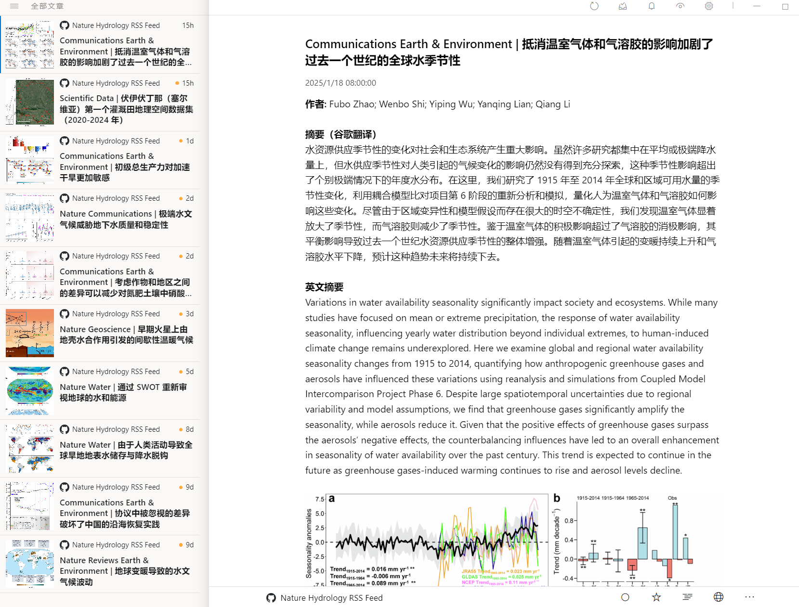

### 简介

本项目提供发表在_Nature_系列期刊上、水文学_Hydrology_领域文章的RSS订阅。

### 特点

- 主动获取以下10本期刊上hydrology领域文章。期刊：Nature、Nature Climate Change、Nature Communications、Nature Geoscience、Communications Earth & Environment、Nature Reviews Earth & Environment、Nature Sustainability、Nature Water、npj Climate and Atmospheric Science、Scientific Data
- RSS订阅中，将文章标题、摘要通过谷歌翻译翻译为中文，同时保留原英文摘要
- 每日更新，如果当天或者几天内没有相关文章，则RSS订阅不会提醒

### 预览

选择一款RSS订阅工具，订阅该项目中的xml文件即可获取hydrology领域研究前沿。通过[fluent-reader](https://github.com/yang991178/fluent-reader)订阅效果如下：

### 修改

- 修改项目中subjects.txt可更换为其他研究领域，或者是增加新的subject，subject至少有一项。subject列表可在nature官网上查看：https://www.nature.com/subjects 。注意：填入的subject必须和列表中的完全一致，否则可能筛选不到文章。
- 如果修改了subject.txt文件，建议同步修改journal list.txt。一行一个，期刊名必须是全称。可在此处查找：https://www.nature.com/siteindex

### 完善

- [ ] 添加作者单位

- [ ] 如果文章代码、数据公开，增加标识符

---

### 版权声明

- 本程序所获得数据皆为出版社公开信息
- 程序所获得数据仅用于个人学习
- 程序获取数据频率处于合理范围

如果你是数据版权拥有者，不希望看到此程序可公开访问，请联系我删除。